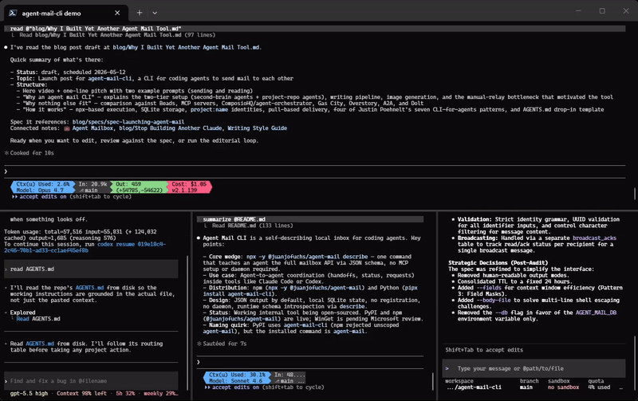

# Agent Mail CLI

[](https://github.com/JuanjoFuchs/agent-mail-cli/actions/workflows/ci.yml)
[](https://github.com/JuanjoFuchs/agent-mail-cli/actions/workflows/release.yml)
[](https://www.npmjs.com/package/@juanjofuchs/agent-mail)
[](https://pypi.org/project/agent-mail-cli/)
[](https://pypi.org/project/agent-mail-cli/)
[](https://github.com/JuanjoFuchs/agent-mail-cli/releases)
[](https://github.com/microsoft/winget-pkgs/pull/371963)
[](https://www.npmjs.com/package/@juanjofuchs/agent-mail)
[](https://pepy.tech/project/agent-mail-cli)
[](https://github.com/JuanjoFuchs/agent-mail-cli/releases)
[](LICENSE)

A self-describing local inbox for coding agents.

<p align="center">
  <a href="docs/agent-mail-hero.mp4">
    
  </a>
</p>

```bash
npx -y @juanjofuchs/agent-mail describe
```

That command is the product wedge: an agent can run it, read the JSON schema,
and learn how to send, read, acknowledge, and inspect messages without MCP
setup, a daemon, or separate documentation.

## Status

This repository is the open-source extraction of a working internal tool.
`src/agent_mail/cli.py` is the Python implementation and source of truth for
behavior. Spec 001 is the behavioral specification. Spec 002 covers Python
packaging, GitHub Release binaries, and WinGet. Spec 003 covers npm and `npx`.

## Why

Multi-agent coding workflows need coordination. Heavy systems already exist
for that: MCP servers, agent frameworks, workspace managers, and network
protocols.

Agent Mail CLI is aimed at the simpler moment:

> I am already inside Claude Code or Codex. I need this agent to send a
> handoff to that agent. I want one command that teaches both sides the
> mailbox.

## Installation

### npx

The primary experience is one command. The npm package name is scoped because
npm rejected the unscoped `agent-mail` and `agent-mail-cli` names; the installed
command remains `agent-mail`.

```bash
npx -y @juanjofuchs/agent-mail describe
```

### npm

```bash
npm install -g @juanjofuchs/agent-mail
agent-mail describe
```

The npm package also exposes `agent-mail-cli` as an alias for compatibility:

```bash
agent-mail-cli describe
```

### pipx

```bash
pipx install agent-mail-cli
agent-mail describe
```

For one-shot Python execution:

```bash
pipx run --spec agent-mail-cli agent-mail describe
```

From source:

```bash
python -m agent_mail describe
```

### WinGet

WinGet support has been submitted and is waiting on Microsoft's package review.
After approval:

```powershell
winget install JuanjoFuchs.agent-mail-cli
```

## Intended Usage

Sender:

```bash
npx -y @juanjofuchs/agent-mail send --from second-brain:main --to ccburn:worker --subject "Review spec" --body "Please read the referenced spec and report risks."
```

Recipient:

```bash
npx -y @juanjofuchs/agent-mail read ccburn:worker
```

## Design Goals

- Runtime schema introspection through `describe`
- JSON output by default
- JSON errors on stderr
- Local durable mailbox state
- No registration
- No daemon
- No MCP server required for v1
- Stable storage outside npm cache (post-packaging)
- One-command install for users without the source script

## Repository Structure

```text
.
├── AGENTS.md
├── CHANGELOG.md
├── CLAUDE.md
├── LICENSE
├── PROJECT_UNDERSTANDING.md
├── README.md
├── docs/
│   └── landscape.md
├── npm/
│   ├── bin/
│   │   └── agent-mail.js
│   ├── scripts/
│   │   └── postinstall.js
│   ├── LICENSE
│   ├── README.md
│   └── package.json
├── specs/
│   ├── 001-agent-mail-cli.md
│   ├── 002-packaging.md
│   └── 003-npm-distribution.md
└── src/
    └── agent_mail/
        ├── __init__.py
        ├── __main__.py
        └── cli.py
```

## Specs

- [specs/001-agent-mail-cli.md](specs/001-agent-mail-cli.md) — behavioral
  specification. Status: pending review.
- [specs/002-packaging.md](specs/002-packaging.md) — PyPI, GitHub Release
  binaries, and WinGet packaging.
- [specs/003-npm-distribution.md](specs/003-npm-distribution.md) — npm wrapper
  and `npx` distribution.

## Naming

- Product: Agent Mail CLI
- Repo: `agent-mail-cli`
- npm package: `@juanjofuchs/agent-mail`
- Python distribution: `agent-mail-cli`
- Python import package: `agent_mail`
- Command: `agent-mail`
- Command alias from npm: `agent-mail-cli`

## License

MIT
